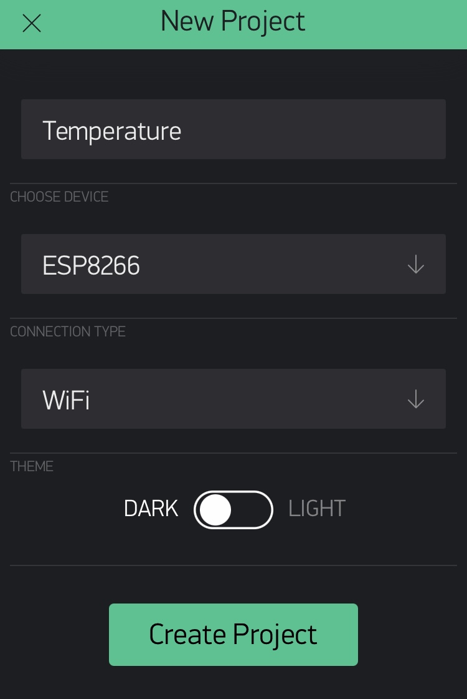

# Бюджетный мониторинг температуры через мобильное приложение


Возникла тут необходимость удаленно контролировать температуру на даче (вода в доме, периодические отключения электричества и тд). 
Гугление привело к [этому решению](https://ivan.bessarabov.ru/blog/diy-wifi-temperature-humidity-sensor) Ивана Бессарабова. 

В нем не совсем понравилось 2 момента: 
* Нужно поднимать свой веб-сервер
* Датчики к микроконтроллеру крепятся на проводах (неаккуратненько)

Дальнейшее гугление натолкнуло на [Blynk](https://blynk.io/) - IoT платформу, которая позволяет принимать сигналы 
с датчиков через интернет и гибко отображать в приложении на iOS/Android. При этом бесплатных возможностей
вполне хватает для моих нужд. Инструкции по подключению к Blynk взял 
[отсюда](https://www.instructables.com/Send-Temperature-Humidity-to-Blynk-App-Wemos-D1-Mi/).

## Шаг 1. Затариваемся на Алиэкспрессе
Итого были куплены:
* Макетные платы [Wemos D1 mini с WiFi](https://aliexpress.ru/item/33043148251.html) по 150 руб.
* [Датчики температуры DHT22](https://aliexpress.ru/item/33043148251.html) по 200 руб. Датчик смонтирован на плате
расширения, что избавляет от лишних проводов и резисторов.
  
## Шаг 2. Сборка
1. Припаиваем разъемы к макетной плате:


2. Припаиваем разъемы к шилду DHT22. Здесь выяснился неприятный нюанс. На шилде сигнал от датчика выведен на пин D4. 
   А из-за [хардварного бага](https://github.com/adafruit/DHT-sensor-library/issues/116#issuecomment-689586883) 
   в данной модели платы, с этого пина сигнал считывается с ошибкой, в итоге вместо значений температуры и влажности 
   мы получаем только NaN. Решение: откусить ножку разъема шилда D4 и проводом соединить сигнальный выход с D5. 
   Вот как это выглядит:
   


   Вид сбоку:


В итоге, сигнал с датчика будет выведен на вход D5 контроллера и это работает.
   
## Шаг 3. Создаем проект в Blynk

1. Скачиваем приложение Blynk из AppStore / Playmarket
2. Регистрируемся
3. Создаем новый проект. В нем выбираем девайс ESP8266 и жмем Create Project:



4. На почту, на которую был зарегистрирован аккаунт в Blynk, будет отправлен токен, который нужно будет указать в скетче, чтобы данные от датчиков приходили именно
в этот проект:
   


5. Добавляем в проект виджет. Для отслеживания температуры очень удобен SuperChart:


6. Настраиваем потоки данных (DataStream). У меня два контроллера/датчика, но данные, разумеется, хочется вывести
на один график. Поэтому я добавил 2 потока (Sensor1 и Sensor2 на картинке):
   


7. Каждый поток данных подключен к своему "виртуальному пину" (VPIN), чтобы можно их было различать на графике:


Также делаем разные цвета у графиков, крутим всякие настройки по вкусу и на этом с Blynk-ом закончено. 

# Шаг 4. Настройка среды разработки

1. Скачиваем и устанавливаем [Arduino IDE](https://downloads.arduino.cc/arduino-1.8.13-windows.exe). На маке 
   подключить плату у меня не получилось, интернет мне помочь не смог, поэтому пришлось все делать на винде
2. Скачиваем и устанавливаем [драйвер](https://docs.wemos.cc/en/latest/ch340_driver.html) для чипа CH340. 
   Он нужен, чтобы плата, подключенная через USB, в Arduino IDE была видна как COM-порт.
3. Подключаем плату к USB компьютера, убеждаемся что среди устройств появилось такое:


**Важный момент**. Как выяснилось, далеко не все micro-USB кабели имеют сигнальный провод. 
Они годятся только для зарядки, но передавать по ним данные нельзя. Так что если устройство в списке не появилось, 
попробуйте подключить его другим кабелем.

4. Запускаем Arduino IDE, открываем настройки и добавляем туда вот такую ссылку для того, чтобы плата Wemos 
   появилась в списке: https://arduino.esp8266.com/stable/package_esp8266com_index.json
   


5. После этого, выбираем плату LOLIN(WEMOS D1 R2 & mini в меню Tools:


6. Подключаем библиотеки DHT и Blynk. **Библиотеку DHT нужно выбирать версии 1.2.3**, начиная с версии 1.3, в нее внесли 
   какие-то изменения, из-за чего значения считываются очень нестабильно, в итоге вместо цифр температуры идут 
   сплошные NaN-ы:
   


## Шаг 5. Программируем

Текст скетча:
```cpp
#include "DHT.h"
#include <ESP8266WiFi.h>
#include <BlynkSimpleEsp8266.h>

#define BLYNK_VPIN    V1        // Виртуальный пин в Blynk, для каждой платы указываем свой
#define BLYNK_TOKEN   ""        // Токен Blynk, присланный на почту
#define WIFI_SSID     ""        // Имя сети WiFi, к которой будет подключаться контроллер
#define WIFI_PWD      ""        // Пароль сети WiFi
#define SEND_INTERVAL 2000L     // Отправлять данные каждые 2 секунды

DHT dht(D5, DHT22); // Датчик DHT22 подключен к цифровому входу D5
BlynkTimer timer;

void setup()
{
  Serial.begin(9600);   // Это значение не должно быть больше 74800, иначе в консоли при отладке будут кракозябры вместо текста
  Blynk.begin(BLYNK_TOKEN, WIFI_SSID, WIFI_PWD);
  dht.begin();
  timer.setInterval(SEND_INTERVAL, sendSensor);
}

void loop()
{
  Blynk.run();
  timer.run();
}

void sendSensor()
{
  float t = dht.readTemperature();
  // float h = dht.readHumidity(); // DHT22 - это датчик не только температуры, но и влажности. Если нужно, то можно передавать и ее
  Serial.print("t = ");
  Serial.println(t);
  if (!isnan(t)) {
    Blynk.virtualWrite(BLYNK_VPIN, t);
  }
}
```
Вбиваем его, заливаем в контроллер, открываем консоль и убеждаемся, что туда выводятся значения температуры.
Заходим в проект Blynk, жмем запустить:


Наслаждаемся!

